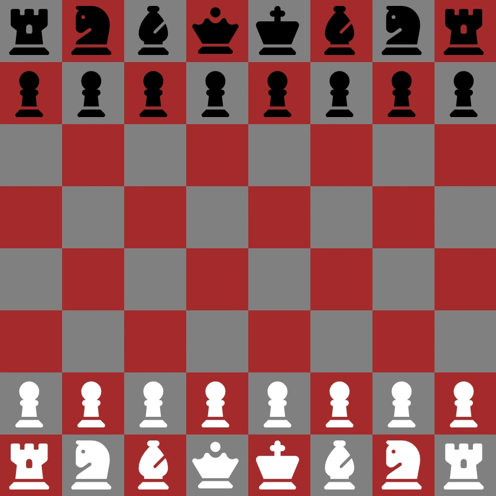

<div align="center">
    <a href="https://chess-fv.netlify.app" target="_blank">
      
    </a>
  <h3 align="center">Chess - JavaScript</h3>
</div>


##  <br /> 📋 <a name="table">Table of Contents</a>


- ✨ [Introduction](#introduction)
- ⚙️ [Tech Stack](#tech-stack)
- 🚀 [Quick Start](#quick-start)


##  <br /> <a name="introduction">✨ Introduction</a>


**[EN]** This project is a test to reproduce the game of chess using only vanilla JavaScript, HTML, and CSS. The goal is to create a fully functional chess game with an intuitive user interface and basic game mechanics, including piece movement, captures, and check/checkmate conditions, all implemented without any external libraries or frameworks.

**[FR]** Ce projet est un test visant à reproduire le jeu d'échecs en utilisant uniquement du JavaScript, HTML et CSS. L'objectif est de créer un jeu d'échecs entièrement fonctionnel avec une interface utilisateur intuitive et des mécanismes de jeu de base, y compris le mouvement des pièces, les captures et les conditions de mise en échec/mat, le tout implémenté sans aucune bibliothèque ou framework externe.


##  <br /> <a name="tech-stack">⚙️ Tech Stack</a>

- HTML
- CSS
- JavaScript


## <br /> <a name="quick-start">🚀 Quick Start</a>


Follow these steps to set up the project locally on your machine.


<br/>**Prerequisites**


Make sure you have the following installed on your machine:


- [Git](https://git-scm.com/)
- [Node.js](https://nodejs.org/en)
- [npm](https://www.npmjs.com/) (Node Package Manager)


<br/>**Cloning the Repository**


```bash
git clone {git remote URL}
```


<br/>**Running the Project**


Use [Live Server](https://marketplace.visualstudio.com/items?itemName=ritwickdey.LiveServer)
to launch a development local server with live reload feature for static & dynamic pages.

